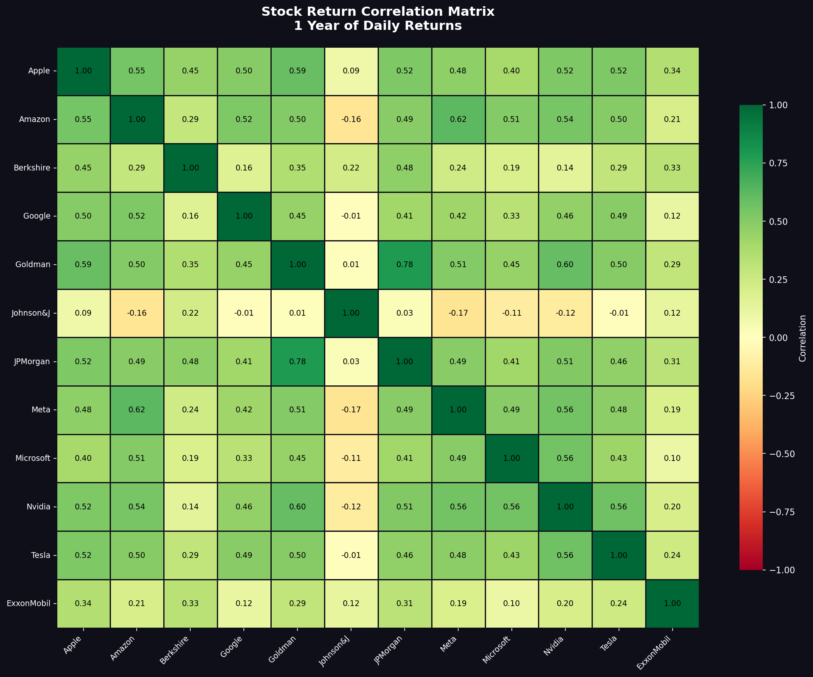
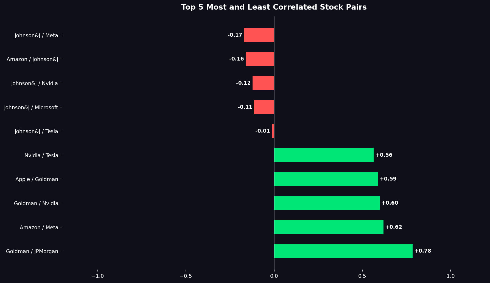

# Stock Correlation Analysis

A Python tool that pulls 1 year of daily stock data for 12 major companies and visualizes how their returns correlate with each other.

---

## Correlation Heatmap



---

## Most & Least Correlated Pairs



---

## What It Does

- Pulls 1 year of daily price data for 12 major stocks using Yahoo Finance
- Calculates daily returns and builds a full correlation matrix
- Generates a color-coded heatmap of all stock correlations
- Identifies the top 5 most and least correlated stock pairs

---

## Key Findings (March 2026)

- Goldman Sachs and JPMorgan are the most correlated at 0.78 — they move with the same market forces
- Johnson & Johnson is nearly uncorrelated with everything — a true defensive stock
- Most tech stocks (AAPL, AMZN, NVDA, META) cluster together with correlations of 0.50-0.62
- ExxonMobil shows low correlation with tech stocks, confirming energy moves independently

---

## Stocks Tracked

| Company | Ticker |
|---------|--------|
| Apple | AAPL |
| Microsoft | MSFT |
| Google | GOOGL |
| Amazon | AMZN |
| Meta | META |
| Tesla | TSLA |
| Nvidia | NVDA |
| JPMorgan | JPM |
| Goldman Sachs | GS |
| ExxonMobil | XOM |
| Johnson & Johnson | JNJ |
| Berkshire Hathaway | BRK-B |

---

## Setup

```bash
git clone https://github.com/NoahMusick4/stock-correlation.git
cd stock-correlation
pip install -r requirements.txt
python src/main.py
```

---

## Project Structure

```
stock-correlation/
├── src/
│   ├── main.py          — runs full pipeline
│   ├── fetch_data.py    — pulls and processes stock data
│   └── visualize.py     — generates heatmap and bar charts
├── outputs/
│   └── charts/          — saved chart images
├── requirements.txt
└── README.md
```

---

## Tech Stack

| Tool | Purpose |
|------|---------|
| Python | Core language |
| yfinance | Live stock data from Yahoo Finance |
| pandas | Return calculations and data manipulation |
| matplotlib | Chart generation |
| seaborn | Heatmap visualization |

---

## Author

Noah Musick — Finance Major, Data Science Minor @ Capital University

[Connect on LinkedIn](https://www.linkedin.com/in/noah-musick-674ba4332) | [View more projects on GitHub](https://github.com/NoahMusick4)
